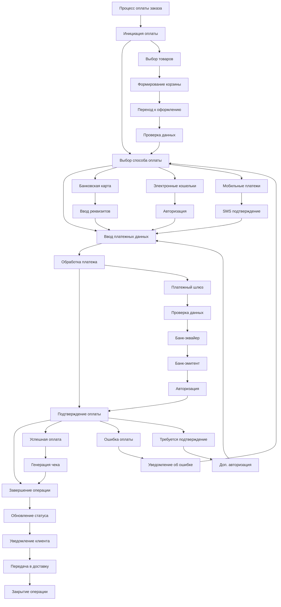

# Mind Map: Процесс оплаты заказа

## Центральный узел: Процесс оплаты заказа

### 1. Инициация оплаты
**Действия:**
- Выбор товаров
- Формирование корзины
- Переход к оформлению

**Данные:**
- Состав заказа
- Итоговая сумма
- Данные доставки

### 2. Выбор способа оплаты
**Варианты:**
- Банковская карта
- Электронные кошельки
- Мобильные платежи
- Наложенный платеж

**Параметры:**
- Доступные методы
- Комиссии
- Сроки зачисления

### 3. Ввод платежных данных
**Типы данных:**
- Реквизиты карты
- Данные электронного кошелька
- SMS подтверждения

**Безопасность:**
- Шифрование данных
- 3D Secure
- Антифрод система

### 4. Обработка платежа
**Участники:**
- Платежный шлюз
- Банк-эквайер
- Банк-эмитент

**Процессы:**
- Авторизация
- Проверка лимитов
- Блокировка средств

### 5. Подтверждение оплаты
**Результаты:**
- Успешная оплата
- Ошибка оплаты
- Требуется доп. подтверждение

**Уведомления:**
- Покупателю
- Магазину
- В систему учета

### 6. Завершение операции
**Действия:**
- Формирование чека
- Обновление статуса заказа
- Начало обработки заказа

**Документы:**
- Электронный чек
- Квитанция об оплате
- Накладная

## Детальная визуализация процесса:

